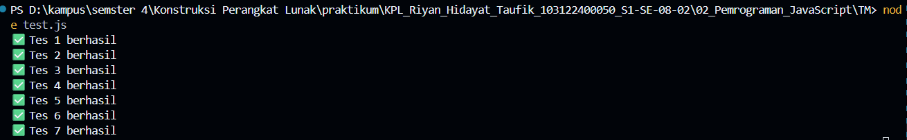

Buatlah sebuah fungsi bernama fizzBuzz yang menerima input larik (array) dan mengembalikan deretan bilangan dan "Fizz" untuk kelipatan 2, "Buzz" untuk kelipatan 7, dan "FizzBuzz" untuk kelipatan 14. Beri nama berkas program sebagai tm.js dan taruh di direktori TM.

disini sempet rada tricky karna untuk spasi dan koma, dan terpecahkan dengan angka kurang sama dengan  1 memakai koma dan diatas 1 memakai spasi

```
 if (i > 0) {
            if (arr[0] === 1 || arr[0] < 0) {
                hasil += ", ";
            } else {
                hasil += " ";
            }
```

ouputnya seperti ini

berhasil semua

