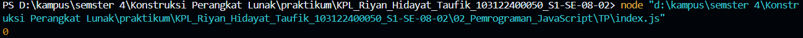

Kamu sudah menulis fungsi mulOfArray. Ujilah dengan input [2, 0, 26, 28, -2], dengan output yang seharusnya adalah 1456. Jika kamu menemukan bahwa hasilnya berbeda, bisakah kamu memperbaikinya? Jika kamu menemukan bahwa hasilnya sama, bisakah kamu menjelaskan mengapa demikian?

Kode sumber

Tersedia di index.js

[soal awal mendapatkan hasil seperti ini](index.js)

kenapa seperti ini? karna angka apapun jika dikalikan dengan angka 0, maka akan menghsilkan angka 0

untuk yang sudah diperbaiki akan menghasilkan output yang benar yaitu 1456
[hasil yang telah diperbaiki](index.js)
kenapa bisa karna telah diganti kode nya dengan benar yaitu, dari dengan menghapus '=' dan hanya menyisakan '>'

yaitu dari awalnya 
  if (arr[i] >= 0) {
     result = result * arr[i]
      } 

menjadi 
 if (arr[i] > 0) {
    result *= arr[i]
    }

jadi seperti cara menyelesaikan code yang benar