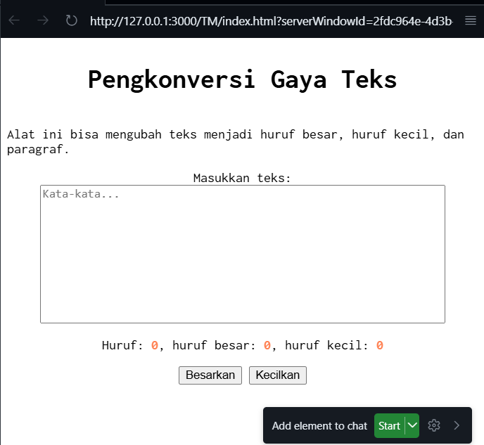

# Tugas Mandiri 03: GUI dengan HTML dan CSS
---
Nama : Riyan Hidayat Taufik
Kelas : SE 08 02
Nim : 103122400050

---

## Soal 
Setelah kamu menyelesaikan tugas pendahuluan (bisa buka di atas), terapkanlah fungsi untuk (1) menghitung huruf kecil yang disediakan di #hk, (2) mengubah huruf kecil ke huruf besar ketika pengguna menekan tombol #huruf-besar, dan (3) mengubah huruf besar ke huruf kecil ketika pengguna menekan tombol #huruf-kecil.

Kemudian, hapuslah fitur "Paragrafkan" dari alat.

NOTE: Asprak akan mereplikasi hasil tugas teman-teman apakah sesuai dengan harapan DAN apakah output, kode sumber, dan deskripsi sama sesuai.

---

## kode sumber
tersedia di [index.js](index.js) dan [index.html](index.html)

---

# Output 

---

# Deskripsi
sebenarnya untuk TP kemarin sudah saya ulik2 untuk saya kasi js nya, karna di TP kemarin ada keterangan untuk menambahkan file .js, jadi untuk TM kali ini saya hanya tinggal menghapus button paragraf saja. dan untuk fungsi besarkan kecilkan juga sudah bisa berfungsi dan menghitung jumlah huruf, huruf besar, dan huruf kecil juga sudah bisa berfungsi secara normal.