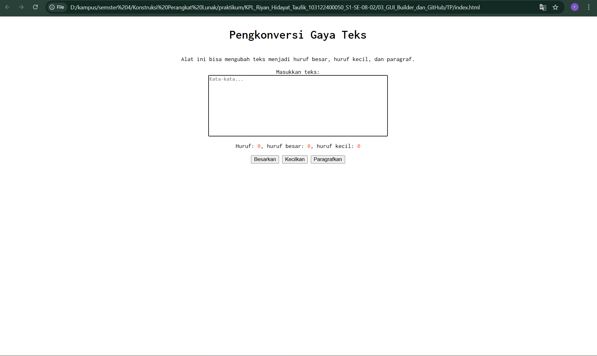

Buatlah tata letak laman yang kamu buat berada di tengah seperti di bawah ini, dan juga ubah font-nya dengan Inconsolata dari Google Fonts.

setelah coba mengulik ulik dan berahsil dibuat seperti yang ada di contoh modul dimana semua dibikin center bagian bodynya dengan cara 
```
body {
    display: flex;
    flex-direction: column;
    align-items: center;
    font-family: 'Inconsolata', monospace;
}
```
dan itu sudah include dengan font yang diminta yaitu Inconsolata dengan cara menambahkan linkhref pada index.html

```
  <link href="https://fonts.googleapis.com/css2?family=Inconsolata:wght@200..900&display=swap" rel="stylesheet">
```
dan didapatkan hasil output 
