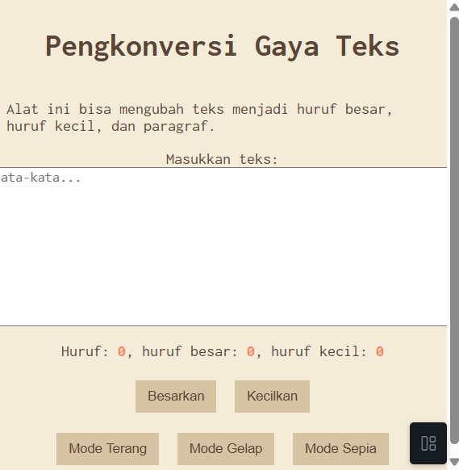

# Tugas Mandiri 04: Automata_dan_Table-Driven_Construction
---
Nama : Riyan Hidayat Taufik
Kelas : SE 08-02
Nim : 103122400050

---
## Soal
penambahan mode sepia dan bisa berpindah state dengan mulus

---
## Kode Sumber
untuk kode sumber sendiri tersedia di [index.html](index.html), [index.css](index.css), dan terakhir yaitu [index.js](index.js)

---
## Output
untuk output sendiri bisa seperti ini 

---
## Deskripsi
Tugas mandiri kali ini yaitu menambahkan mode baru yaitu mode sepia yang terlihat lebih clasic dengan ketentuan warna yang sudah diberikan. setelah itu juga ada perpindahan yang mulus agar lebih enak untuk experiencenya, dan dilihat pun enak juga
