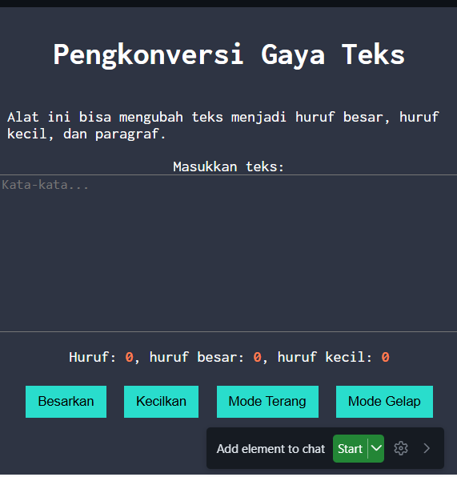

# Tugas Pendahuluan 04: Automata_dan_Table-Driven_Construction
---
Nama : Riyan Hidayat Taufik
Kelas : SE 08-02
Nim : 103122400050

---
## Soal
Tambahkan mode gelap sekaligus untuk editor-kecil dan tombol-tombolnya. Ketentuan warna untuk latar belakang editor-kecil adalah #2e3443, sementara untuk tombol adalah #29ddcc. Teks untuk tombol tetap mengikuti warna teks sebelumnya.

Untuk menghapus pinggiran tombol, nyatakan properti border untuk tidak ditunjukkan.

---
## Kode Sumber
untuk kode sumber semua tersedia di [index.css](index.css) lalu [index.html](index.html) dan [index.js](index.js)

---
## Output 
untuk output sendiri 

---
## Deskripsi
Di tugas pendahuluan ini, adanya penambahan fitur yaitu 2 tombol (mode gelap dan terang), mode gelap dengan mengubah latar belakang berwarna #2e3443 dan tombol berwarna #29ddcc. sementara untuk tombol terang berfungsi mengembalikan tampilan halaman ke mode semula.