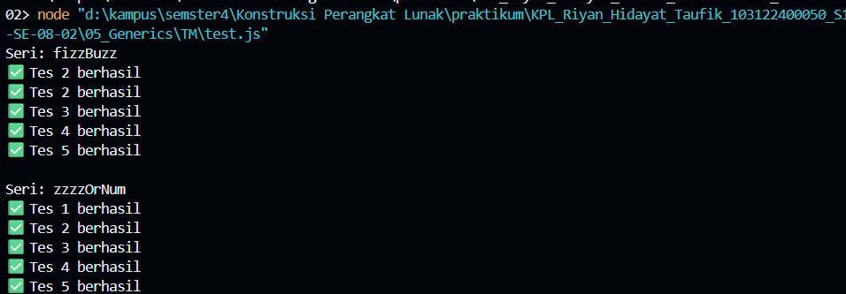

# Tugas Mandiri 05: Generics
---
Nama : Riyan Hidayat Taufik
Kelas : SE 08-02
Nim : 103122400050

---
## Soal
1. Fungsi fizzBuzz hanya menerima larik yang semua elemennya terdiri dari bilangan bulat dan mengeluarkan larik pula yang bisa jadi bercampur string dan bilangan
2. Fungsi zzzzOrNum hanya menerima sebuah data tunggal berupa bilangan bulat dan mengembalikan "Fizz", "FizzBuzz", "Buzz", atau bilanga bulat sesuai logikanya
3. Kedua fungsi harus ada dan harus disertai JSDoc sesuai tipe data yang disiratkan dari no. 1, no. 2, dan perilaku yang diharapkan di bawah
4. fizzBuzz harus menggunakan fungsi zzzzOrNum di dalamnya

---
## Kode Sumber
untuk kode sumber sendiri tersedia di [index.js](index.js), dan untuk pengecekan bisa di [test.js](test.js)

---
## Output
untuk output sendiri bisa seperti ini 

---
## Deskripsi
Tugas Mandiri kali ini, program ini mengimplementasikan logika FizzBuzz secara modular dengan memisahkan validasi angka individual ke dalam fungsi zzzzOrNum dan pemrosesan koleksi data ke dalam fungsi fizzBuzz. Penggunaan metode .map() pada fungsi utama bertujuan untuk memastikan efisiensi kode dan menjaga prinsip immutability pada array input.
