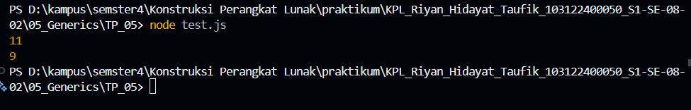

# Tugas Pendahuluan 05 : Generics
---
Nama : Riyan Hidayat Taufik
Kelas : SE 08-02
Nim : 103122400050

---
## Soal 
Bagaimana caramu hanya dengan satu fungsi generik bisa mengurus keduanya? dengan kode tes bisa di test pada [test.js](test.js) 

---
## Kode Sumber
saya menulis kode saya ada di [tm.js](tm.js) dan untuk pengetesan ada di  [test.js](test.js) 

---
## Output
hasil output dari pengetesan sebagai berikut 

---
## Deskripsi

Pada soal ini diberikan kode JavaScript untuk menghitung jumlah seluruh karakter dan jumlah huruf (tanpa spasi) menggunakan dua perulangan terpisah. Permasalahannya adalah menggabungkan kedua proses tersebut ke dalam satu fungsi yang bersifat generik.

Solusi dilakukan dengan membuat fungsi hitung yang menerima parameter string dan tipe perhitungan. Tipe tersebut kemudian dipetakan menjadi kondisi tertentu untuk menentukan karakter yang dihitung.

Dengan cara ini, fungsi menjadi lebih fleksibel dan dapat digunakan untuk berbagai kebutuhan, sesuai dengan konsep generics.

