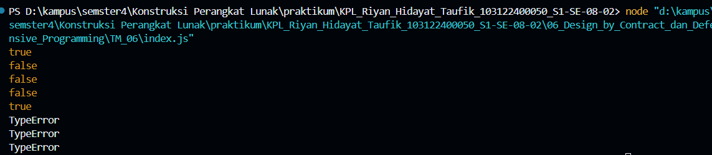

# Tugas Mandiri 06: Design_by_Contract_dan_Defensive_Programming
---
Nama : Riyan Hidayat Taufik
Kelas : SE 08-02
Nim : 103122400050

---
## Soal
 membuat fungsi yang menolak bilangan-bilangan kelipatan 3, 5, atau 15, menerima bilangan-bilangan bukan "fizz buzz", dan melempar yang bukan bilangan bulat.

---
## Kode Sumber
untuk kode sumber sendiri tersedia di [index.js](index.js)

---
## Output
untuk output sendiri bisa seperti ini 

---
## Deskripsi
Penugasan ini bertujuan untuk mengimplementasikan fungsi is_not_fizzbuzz dengan menerapkan konsep Design by Contract dan Defensive Programming, di mana fungsi akan mengembalikan nilai true untuk bilangan yang bukan kelipatan 3 atau 5, serta false untuk bilangan yang termasuk kategori fizz buzz. Selain itu, fungsi juga melakukan validasi input secara ketat dengan hanya menerima bilangan bulat yang valid, dan akan melempar TypeError jika diberikan input yang tidak sesuai seperti null, NaN, atau Infinity, sehingga program menjadi lebih aman dan andal.
