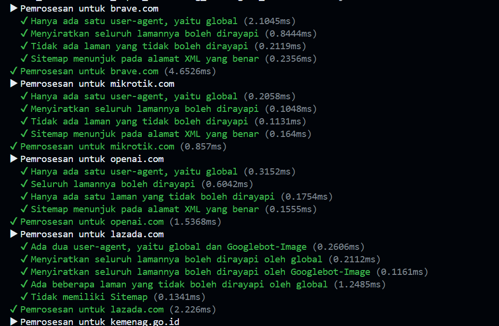

# Tugas Mandiri 07 : Grammar-Based_Input_Processing_Parsing
---
Nama : Riyan Hidayat Taufik
Kelas : SE 08-02
Nim : 103122400050

---
## Soal 
membuat fungsi yang menguraikan isi robots.txt menjadi POJO (plain old JavaScript object). Empat properti yang perlu diuraikan dijabarkan di bawah berikut.

User-agent adalah nama robot perayapnya
Allow adalah daftar halaman-halaman yang boleh dirayap
Disallow adalah daftar halaman-halaman yang tidak boleh dirayap
Sitemap adalah sebuah pranala yang menunjuk pada "denah" situs web (biasanya berformat XML)
Kamu akan mengerjakannya di dalam sebuah fungsi bernama parseRobots di index.js dan. Buka direktori 07 di sini untuk mengunduh berkas yang dimaksud, berkas-berikas robots.txt di dalam direktori daftar, dan berkas pengujiannya yaitu test.js.

---
## Kode Sumber
saya menulis kode saya ada di [index.js](index.js) dan mengetesnya di file [test.js](test.js)
---
## Output
hasil output dari pengetesan sebagai berikut 

---
## Deskripsi
Di tugas ini saya diminta untuk membuat sebuah fungsi bernama parseRobots yang berfungsi untuk mengolah isi file robots.txt menjadi sebuah objek JavaScript (POJO) yang terstruktur. Prosesnya dilakukan dengan membaca teks baris per baris, lalu mengidentifikasi bagian-bagian penting seperti User-agent, Allow, Disallow, dan Sitemap. Setiap User-agent disimpan sebagai key dalam objek, dengan daftar halaman yang boleh dan tidak boleh diakses dalam bentuk array. Selain itu, saya juga harus menangani beberapa kondisi khusus seperti nilai Disallow yang kosong, beberapa user-agent dalam satu grup, serta memastikan semua nama agent disimpan dalam huruf kecil. Hasil akhirnya kemudian diuji menggunakan test.js untuk memastikan fungsi yang dibuat sudah sesuai dengan berbagai contoh file robots.txt yang diberikan.

