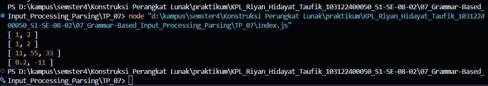

# Tugas Pendahuluan 07 : Grammar-Based_Input_Processing_Parsing
---
Nama : Riyan Hidayat Taufik
Kelas : SE 08-02
Nim : 103122400050

---
## Soal 
Buatlah fungsi yang mengubah deretan angka bertipe string menjadi larik angka.

---
## Kode Sumber
saya menulis kode saya ada di [index.js](index.js)
---
## Output
hasil output dari pengetesan sebagai berikut 

---
## Deskripsi
di tp ini mempelajari penguraian dan diminta untuk memanfaatkan fungsi-fungsi bawaan seperti split(), trim()

