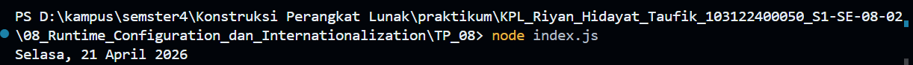

# Tugas Pendahuluan 08 : Runtime_Configuration_dan_Internationalization
---
Nama : Riyan Hidayat Taufik
Kelas : SE 08-02
Nim : 103122400050

---
## Soal 
Tampilkan tanggal sekarang dengan format seperti ini:

Sabtu, 18 April 2026
Nilai waktu tidak harus sama, asalkan formatnya benar dan bisa tampil di komputer terpisah pada waktu tertentu. Gunakan Intl.DateTimeFormat (bukan string manual).

---
## Kode Sumber
saya menulis kode saya ada di [index.js](index.js)
---
## Output
hasil output dari pengetesan sebagai berikut 

---
## Deskripsi
Pada penugasan ini,diminta untuk menampilkan tanggal saat ini dengan format bahasa Indonesia menggunakan fitur bawaan JavaScript yaitu Intl.DateTimeFormat. Tujuannya untuk memahami cara kerja internasionalisasi (i18n) tanpa membuat format tanggal secara manual. Program dibuat sederhana menggunakan Node.js, pertama dari mengambil waktu saat ini dengan new Date(), lalu memformatnya sesuai locale id-ID agar menghasilkan tampilan seperti “Sabtu, 18 April 2026”, kemudian hasilnya ditampilkan ke terminal. Penugasan ini juga melatih pemahaman dasar tentang bagaimana aplikasi bisa menyesuaikan output berdasarkan bahasa dan wilayah tertentu.

