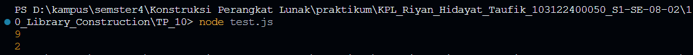

# Tugas Mandiri 10: Library_Construction
---
Nama : Riyan Hidayat Taufik
Kelas : SE 08-02
Nim : 103122400050

---
## Soal 
Buatlah pustaka JavaScript yang menyediakan utilitas berupa dua fungsi yang menghitung jumlah huruf dan jumlah kata.

Kriteria:

Hanya alfabet A hingga Z yang dihitung (besar dan kecil)
Spasi tidak dihitung
Pustaka bisa diimpor

---
## Kode Sumber
saya menulis kode saya ada di [index.js](index.js)dan testnya di [test.js](test.js)
---
## Output
hasil output dari pengetesan sebagai berikut 
---
## Deskripsi
Tugas ini bertujuan untuk membuat pustaka JavaScript sederhana yang menyediakan dua fungsi utilitas, yaitu fungsi untuk menghitung jumlah huruf dan fungsi untuk menghitung jumlah kata. Perhitungan huruf hanya mencakup karakter alfabet A-Z, baik huruf besar maupun huruf kecil, sehingga angka, simbol, tanda baca, dan spasi tidak ikut dihitung.

